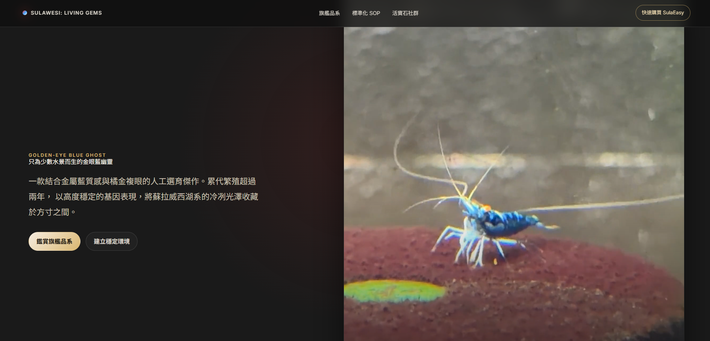

# Sulawesi: Living Gems

蘇拉威西：原生之美，是一個以高單價觀賞蘇拉威西蝦為主題的極簡奢華形象網站。

## DemoLink

[DemoLink](https://sulawesi-test.vercel.app/)

## Pages

- `index.html`：首頁、Hero 微距影片、品種介紹、Care SOP、水質參數計算器
- `species.html`：品種百科頁、難度篩選器、品系資訊卡

## Assets

- `assets/css/styles.css`：網站樣式
- `assets/js/app.js`：互動功能
- `assets/js/chatbot.js`：AI 養殖顧問聊天視窗（前端）
- `sources/`：實拍照片與影片素材

## Docs

- `docs/sulawesi-species-research.md`：蘇拉威西蝦品系・分類研究筆記（來源與檢索紀錄）
- `docs/log.md`：對話紀錄
- `docs/work-report.md`：工作報告

## AI 養殖顧問（聊天機器人）

浮動聊天視窗會回答蘇拉威西蝦養殖與 SulaEasy 相關問題。前端為純 JS（`assets/js/chatbot.js`），後端代理為 `api/chat.js`，依序 fallback：Groq → Gemini → OpenRouter（皆可用免費層）。

### 部署（建議：整站放 Vercel）

1. 在 [Vercel](https://vercel.com) 匯入本 GitHub repository（框架選 **Other**；靜態頁與 `api/` 函式會自動被辨識）。
2. Settings → Environment Variables 至少設定一組金鑰（越多 fallback 越穩）：
   - `GROQ_API_KEY`（<https://console.groq.com/keys>）
   - `GEMINI_API_KEY`（<https://aistudio.google.com/app/apikey>）
   - `OPENROUTER_API_KEY`（<https://openrouter.ai/keys>）
3. Deploy。前端會呼叫同網域的 `/api/chat`，免處理 CORS。

### 若前端仍留在 GitHub Pages

只把 `api/` 部署到 Vercel，然後：
- 在 `assets/js/chatbot.js` 把 `CHAT_ENDPOINT` 改成完整網址（例：`https://你的專案.vercel.app/api/chat`）。
- 在 Vercel 設定 `ALLOWED_ORIGINS=https://chenyuhsu413.github.io`。

金鑰只存在 Vercel 環境變數，不會進版控（`.env.local` 已被 `.gitignore` 排除；`.env.example` 為不含金鑰的範本）。
